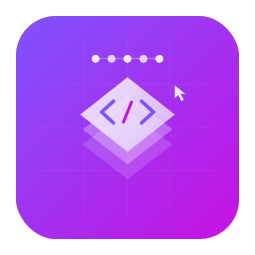

<p align="center">
  
</p>

<h1 align="center">ComposeStudio</h1>

<p align="center">
  <strong>Visual UI Designer for Compose Multiplatform</strong>
</p>

---

ComposeStudio is a visual UI designer application built with Compose Multiplatform for creating Compose Multiplatform applications. It provides a drag-and-drop interface where developers can visually construct user interfaces, similar to Visual Studio's WinForms designer.

## Features

- **Design Canvas** — Place and arrange UI components on a grid-based canvas with drag-and-drop
- **Component Palette** — Standard Compose components organized by category (Basic, Input, Layout)
- **Properties Panel** — Configure component attributes including position, size, text, colors, and more
- **Real-time Preview** — See live previews of components as you design
- **Code Generation** — Export the designed UI as ready-to-use Compose Multiplatform Kotlin code
- **Component Hierarchy** — View and manage all components in a tree structure
- **Undo/Redo** — Full undo/redo support for all design operations
- **Dark Theme** — Professional dark theme optimized for design work

## Supported Components

| Category | Components |
|----------|-----------|
| **Basic** | Text, Button, Image, Divider, IconButton, FAB, Progress Bar, Progress Circle |
| **Input** | TextField, Checkbox, Switch, Slider |
| **Layout** | Card, Column, Row, Box, Spacer |

## Getting Started

### Prerequisites

- JDK 17 or later
- Gradle 8.5+ (wrapper included)

### Build & Run

```bash
# Clone the repository
git clone https://github.com/HighSpringSun/ComposeStudio.git
cd ComposeStudio

# Run the application
./gradlew run

# Build a distributable package
./gradlew packageDmg        # macOS
./gradlew packageMsi        # Windows
./gradlew packageDeb        # Linux
```

## Usage

1. **Add Components** — Click a component in the left palette, then click on the canvas to place it
2. **Select & Move** — Click a component on the canvas to select it, then drag to reposition
3. **Resize** — Use the resize handle (bottom-right corner) on selected components
4. **Edit Properties** — Select a component and modify its attributes in the right Properties panel
5. **View Hierarchy** — See all components listed in the bottom-left Hierarchy panel
6. **Generate Code** — Click the code icon (or Ctrl+G) to view generated Compose code
7. **Undo/Redo** — Use Ctrl+Z / Ctrl+Shift+Z or the toolbar buttons

## Architecture

```
src/main/kotlin/composestudio/
├── Main.kt                          # Application entry point & main window
├── action/
│   └── Action.kt                    # Undo/redo action system
├── model/
│   ├── DesignComponent.kt           # Component types & property models
│   └── DesignState.kt               # Central state management
└── ui/
    ├── canvas/
    │   └── DesignCanvas.kt          # Design canvas with component rendering
    ├── codegen/
    │   ├── CodeGenerator.kt         # Compose code generation engine
    │   └── CodeGenerationPanel.kt   # Code viewer panel UI
    ├── hierarchy/
    │   └── ComponentHierarchy.kt    # Component tree view
    ├── palette/
    │   └── ComponentPalette.kt      # Component palette with categories
    ├── properties/
    │   └── PropertiesPanel.kt       # Property editor panel
    └── theme/
        └── StudioColors.kt          # Dark theme color definitions
```

## Keyboard Shortcuts

| Shortcut | Action |
|----------|--------|
| `Ctrl+Z` | Undo |
| `Ctrl+Shift+Z` | Redo |
| `Ctrl+G` | Toggle code generation panel |
| `Ctrl+N` | New design |
| `Delete` | Delete selected component |
| `Ctrl+Q` | Exit |

## License

See [LICENSE](LICENSE) for details.
